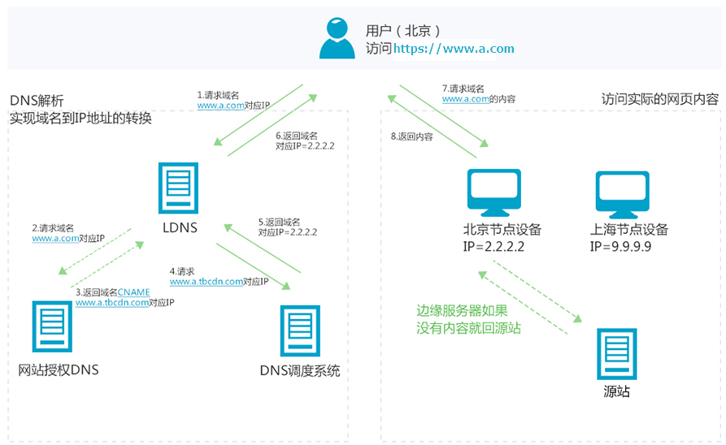
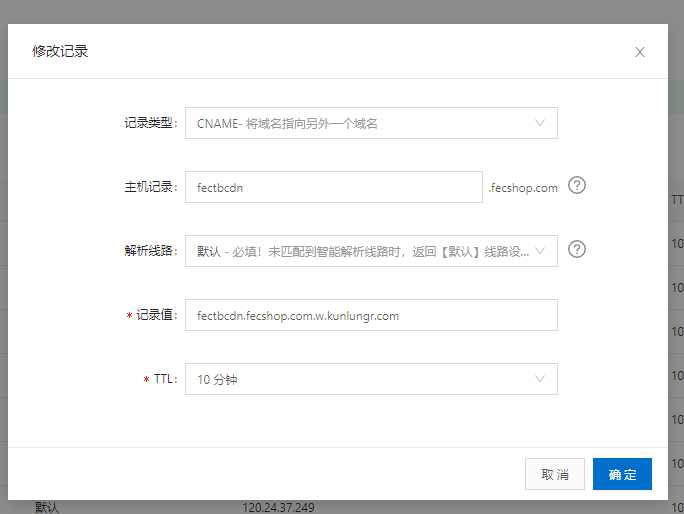
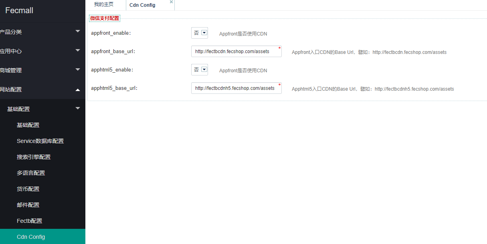
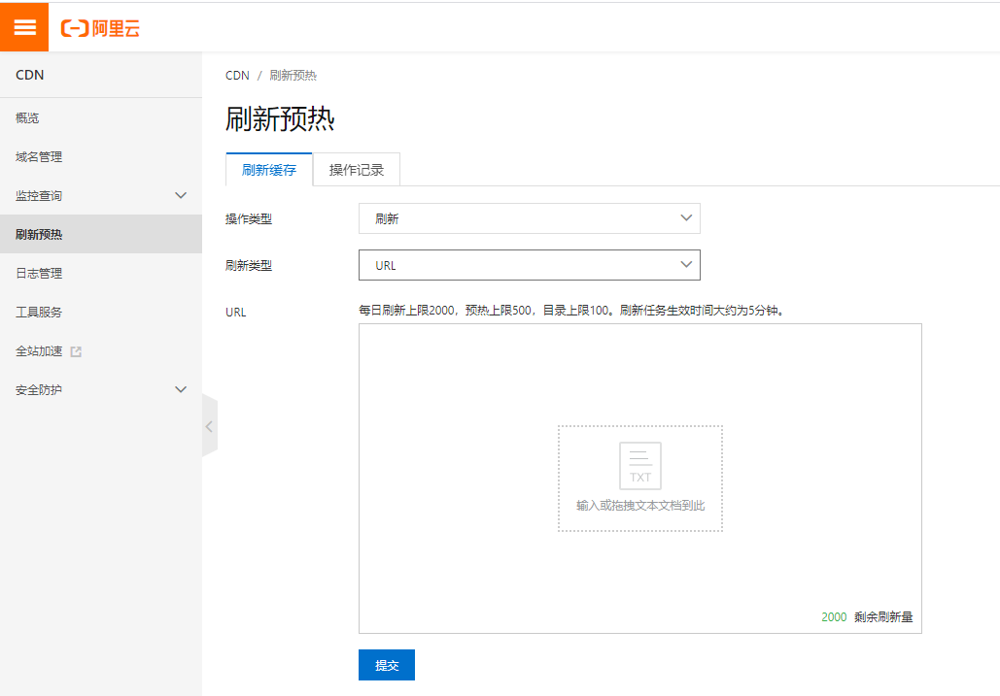

Fecmall-CDN-阿里云
===========

> 该应用，可以方便的将商城前端的js，css，样式图片等等静态资源，发布到CDN，加快网站的加载速度

### 关于CDN

`CDN`即内容分发网络（Content Delivery Network）的简称，是建立在承载网基础上的虚拟分布式网络，
能够将源站内容（包括各类动静态资源）智能缓存到全球各节点服务器上。这样不仅方便了用户就近获取内容，
提高了资源的访问速度，也分担了源站压力。


可以将fecmall的web目录的`asset`文件夹下的静态，使用第三方Cdn, 通过独立的CDN域名进行访问加载静态资源，加快网站的加载速度


### Fecmall cdn 应用插件

Fecmall cdn应用市场地址：http://addons.fecmall.com/86929949

fecmall后台`在线安装`即可，目前对前端商城 `appfront`和 `apphtml5` 加入了CDN配置。

CDN工作原理：




通俗的来说大致如下：

按照常规，我们的商城，`js`和`css`使用独立的域名，譬如：`fectbcdn.fecshop.com` 作为静态资源的域名
，商城页面加载后，访问的就是这个域名，由于放到了服务器，受`带宽`，`并发`，以及各个城市`地理位置`等因素，导致静态资源加载过慢，
那么我们可以使用`CDN`，来解决这个问题

当我们部署好CDN后，工作步骤

1.当访问 `http://fectbcdn.fecshop.com/xxx.js`，由于域名的CNAME指向的是CDN的地址，因此请求发送到了cdn

2.cdn接收请求后，检测访问用户的`地理位置`，然后分配离用户最近的`ip节点`

3.离用户最近的`ip节点`接收请求后，然后去该域名对应的`缓存`中找相应的文件

4.当该节点，找到文件后，直接返回，请求结束

5.当该`节点`，找不到文件后，则会通过`源站信息`里面配置的ip地址，去`源站`（就是我们服务器）去下载这些`静态资源`
，下载后，cdn就会缓存该文件，当用户下次请求，直接从缓存中获取返回，这样就缓解了我们服务器的压力


### Fecmall CDN配置


1.开通cdn服务，下面以阿里云为例子，appfront的`cdn`域名为：`fectbcdn.fecshop.com`

阿里云CDN开通购买地址：https://www.aliyun.com/product/cdn

开通后，即可进入cdn管理控制台：https://cdn.console.aliyun.com/domain/list

1.1添加域名


关于`源站信息`的说明：https://help.aliyun.com/knowledge_detail/40117.html

您可以按照上图的设置，按照`ip`找源站的方式，`ip`的值填写您的服务器的`ip`（大致原理就是，当cdn没有缓存css，js文件等，就会访问从该ip的服务器上面下载这些静态文件，缓存到cdn中）

1.2添加域名后，在域名列表可以看到`CNAME`（一般需要等几分钟才能出来`CNAME`的值）


1.3进入您购买域名的服务商控制台，进入域名解析，`fectbcdn.fecshop.com`的域名解析如图（下面的截图是阿里云的域名解析界面）：



域名的`CNAME`，就是CDN添加域名后生成出来的`CNAME` ， 等域名解析生效，然后进行fecmall的配置


2.fecmall nginx配置

我们需要配置源站的js和css访问域名，我们的静态资源的域名为：`fectbcdn.fecshop.com`，下面是一个操作示例：

nginx配置域名：`fectbcdn.fecshop.com`，将其指向 `@appfront/web`目录（因为assets就是在这个目录下面）

譬如nginx的配置（例子）


```
server {
    listen       80;
    server_name  fectbcdn.fecshop.com;
    root  /www/web/demo/fectb/appfront/web;
	server_tokens off;
    include none.conf;
    index index.php index.html index.htm;
    access_log /www/web_logs/access.log wwwlogs;
    error_log  /www/web_logs/error.log  notice;
    location ~ .*\.(gif|jpg|jpeg|png|bmp|swf)$ {
        expires      30d;
    }

    location ~ .*\.(js|css)?$ {
        expires      12h;
    }
```

重启nginx

3.后台设置fecmall CDN


进入后台，如图：




`appfront_enable`：Appfront是否使用CDN ，选择`是`开启CDN

`appfront_base_url`：Appfront入口CDN的Base Url，譬如：http://fectbcdn.fecshop.com/assets 

`apphtml5_enable`：Appfront是否使用CDN  ，选择`是`开启CDN


`apphtml5_base_url`：Apphtml5入口CDN的Base Url，譬如：http://fectbcdnh5.fecshop.com/assets


设置后，到这里就完成，对于apphtml5入口：http://fectbcdnh5.fecshop.com/assets ， 
原理和appfront一致，参看步骤即可


### 测试


1.`ping  fectbcdn.fecshop.com` 检测是否解析完成，另外可以检测，是不是不同的城市ping该值，得到的ip是否不同，如果不同
，则说明阿里云cdn域名解析已经生效


另外一个方法`测试cdn`是否成功：
主要查看响应头信息中的`X-Cache`字段,显示了`MISS`表示没有命中CDN缓存、显示了`HIT`表示命中了CDN缓存。


2.访问网站，查看css，js是否加载，然后浏览器查看`源代码`，js，css的url中是否含有，cdn域名对应的url


### cdn静态文件预热和更新

当您的css，js等文件进行更新后，您可以在阿里云cdn控制台进行`文件刷新`，或者`预热`




其他的参考资料：http://www.fecmall.com/topic/2302


阿里云CDN官方文档：https://help.aliyun.com/product/27099.html


