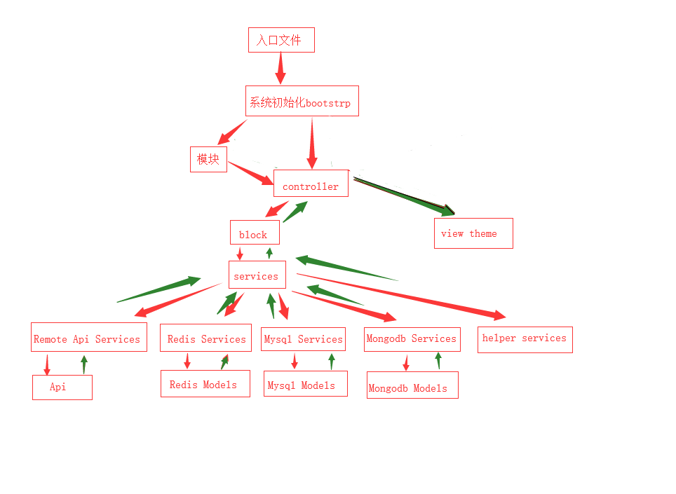

Fecmall 架构结构
================

> 这里说明的是fecmall的文件结构，执行流程等知识。


一：总览
------

Fecmall在MVC三层架构上，加入了block层和services层，方便扩展和后期重构底层

`入口文件`：终端用户能直接访问的 PHP 脚本， 负责启动一个请求处理周期，譬如：@app/web/index.php

`系统初始化bootstrap`：指的是系统的初始化过程中执行的部分，譬如store语言，货币等，
都是在初始化过程中执行。

`模块`：yii2框架中的模块部分

`controller`：控制器，一个controller里面有多个action方法，每个action请求，一般对应
一个block，用来处理该action下面的逻辑

`block`: 逻辑处理层，负责处request发送的数据，调用相应的services方法，然后
进行处理返回最终数据，一般一个controller中的一个action，对应一个block文件

`services`：服务层，该层为fecmall的核心部分，很多的逻辑都是在此处实现，
对于某个功能，譬如购物车部分，您可以实现多个services，然后通过配置的方式进行切换，
譬如官方实现的redis cart，可以替代mysql cart，因此该层的加入，让您可以方便的重构底层，
根据业务的需求，开发不同的services，甚至使用远程的api封装成services，
让底层的重构更加容易，同时该结构扩展性强，应用市场可以开发不同的services应用插件，
让用户可以方便的安装应用直接切换其他的services

另外该层为共用层，pc，wap，vue，微信小程序，都公用services层

fecmall大多数的逻辑实现以及业务处理，都是在services层进行的。

`models`：数据库层

`view`：视图渲染层view




二：Composer包结构
------

### 1. Fecmall核心包

`https://github.com/fancyecommerce/yii2_fecshop`

这个是FecMall的核心包，里面包含 入口系统（appfront Appadmin等）
，以及对应的模块配置，还包含扩展的yii2 component，
重写的yii2的类，以及fecshop services(服务)，model,shell(命令行)，
migrations(数据库安装)等等。

这个包类似yiisoft/yii2，将fecmall核心代码以扩展的方式制作，
是为了解决fecmall升级和yii2二次开发者重新扩展fecmall的冲突

安装后，该包的文件路径为：`vendor/fancyecommerce/fecshop`

### 2. Fecmall入口包

`https://github.com/fancyecommerce/yii2_fecshop_app_advanced`

这个是fecmall的web入口包，里面有 `appadmin/web`,`appfront/web`，
以及图片web的路径，nginx解析到这些路径，就可以进行访问了
，入口文件index.php就在这个包中，index.php中加载fecshop核心代码的配置.

这个包类似 `https://github.com/yiisoft/yii2-app-advanced`，
起到一个web访问路径，加载fecmall核心代码的作用，
安装这个包后，fecmall核心包，会以扩展依赖的方式被加载过来，同样yii2的核心库
也是这样。

### 3.其他依赖包

其他的不一一列举，这个安装后在vendor文件夹下面可以查看，
这里面有两个我开发的扩展

DWZ(JUI)和yii2整合的后台扩展:
https://github.com/fancyecommerce/yii2_fec_admin

基础封装扩展:
https://github.com/fancyecommerce/yii2-fec


### 4.为什么把Fecmall的核心代码做成扩展包的方式？

对这个有疑问的朋友也比较多，为什么要做成扩展包，原因：

要解决Fecmall升级和使用者二开的文件冲突问题，为了方便升级，
使用者无权修改/vendor/fancyecommerce/fecshop下面的文件，只能通过配置的方式进行
重写，如果强制修改/vendor/fancyecommerce/fecshop下面的文件，升级后将会被清除，
因此，fecmall做成composer包非常合适，通过composer进行升级解决文件包依赖问题，
开发者的开发文件和fecmall的源文件，以及应用插件进行隔离，
不影响相互升级。


二：FecShop核心包文件结构
---------------------

打开`vendor/fancyecommerce/fecshop` ，这里就是fecshop的核心代码包。

### 1.app 文件夹

`@fecshop/app`里面 是各个入口系统的文件代码，包含 
`@fecshop/app/appadmin`,`@fecshop/app/appfront`等。

#### 1.1`@fecshop/app/appfront`

这里是前端pc代码，打开`@fecshop/app/appfront`，可以看到如下文件夹：

```
@fecshop/app/appfront/config    		#appfront的配置代码部分
@fecshop/app/appfront/helper			#appfront的各个模块的公用helper类
@fecshop/app/appfront/languages			#appfront的语言翻译包部分
@fecshop/app/appfront/modules			#appfront的模块部分
@fecshop/app/appfront/theme				#appfront的模板theme部分
@fecshop/app/appfront/widgets			#appfront的小部件数据提供部分，这里的小部件是一个展示块，譬如页面的顶部，底部，侧栏显示产品浏览记录等等，就是显示的一个区块。
```

#### 1.1.1 `@fecshop/app/appfront/modules`

此文件夹下面的各个文件夹都是一个模块,下面是详细说明

```
@fecshop/app/appfront/config							#模块的配置文件夹
@fecshop/app/appfront/modules/AppfrontController.php	#是各个模块中controller的基类。
@fecshop/app/appfront/modules/AppfrontModule.php		#是各个模块的Module.php的基类。
```
    
进入catalog 这个模块，你会看到

```
@fecshop/app/appfront/modules/catalog/block			# 模块的中间逻辑层
@fecshop/app/appfront/modules/catalog/controllers	# 模块的控制层文件
@fecshop/app/appfront/modules/catalog/helpers		# 模块的帮助类文件
@fecshop/app/appfront/modules/catalog/Module.php  	# 模块的入口文件，也就是在配置文件中指定该文件。
```

需要说明的是block是fecshop新加的一个层，
按照MVC逻辑，model的数据返回给controller中，这会造成controller
非常的膨大，因此，新加层后，fecshop的数据传递过程为：

`用户访问-->fecshop初始化--->controller--->block--->services--->model`。

model从数据库得到数据，然后返回数据:

`model--->services--->block--->controller--->view-->反馈给用户html`

很多的数据的中间逻辑处理，都是在block层完成。

controller只负责调度，这样层次比较分明，参看详细代码，您应该就会看明白详细。
譬如：

`fecshop\app\appfront\modules\Catalog\controllers\ProductController`中的方法：

```
public function actionIndex()
{
	$data = $this->getBlock()->getLastData();
	return $this->render($this->action->id,$data);
}
```

`$this->getBlock()` 返回的是
`fecshop\app\appfront\modules\Catalog\block\product\Index.php`对应的对象，
执行Index对象的`getLastData()`方法，返回给$data数组，然后，render函数将
数据传递给view层。

加入block层除了文件结构的层次分明，还会更好的重用函数，精简代码。
	
	
#### 1.1.2`@fecshop/app/appfront/theme`

这里是fecshop的模板部分，fecshop是在yii2基础上进行了二次修改封装，
使用的是多模板系统，关于fecshop多模板，你可以看我的博文：

[yii2 fecshop 多模板的介绍](http://www.fancyecommerce.com/2016/06/30/yii2-fecshop-%e5%a4%9a%e6%a8%a1%e6%9d%bf%e7%9a%84%e4%bb%8b%e7%bb%8d/)
	
[yii2 多模板路径优先级加载view方式下- js和css 的解决](http://www.fancyecommerce.com/2016/07/06/yii2-%e5%a4%9a%e6%a8%a1%e6%9d%bf%e8%b7%af%e5%be%84%e4%bc%98%e5%85%88%e7%ba%a7%e5%8a%a0%e8%bd%bdview%e6%96%b9%e5%bc%8f%e4%b8%8b-js%e5%92%8ccss-%e7%9a%84%e8%a7%a3%e5%86%b3/)
	
	
### 2.@fecshop/components

这是fecshop扩展的component（yii2 组件），这里只有一个store.php，这个概念属于yii2的知识
	
### 3.@fecshop/config

各个app，譬如appfront appadmin公用的配置部分，里面大多数的配置是对services的配置,
以及组件配置。

### 4.@fecshop/interfaces 

公用接口部分

### 5.lib

一些第三方的类库文件（不基于composer的库包，不支持namespace的一些老库包）

### 6.migrations

这个是在安装fecshop对应的数据库部分，执行后，您的本地将会安装
数据库表，索引，以及数据。


### 7.models

数据库对应的models，fecmall的所有的models都放到该文件夹下面

### 8.services

Fecshop 服务，是各个app端公用的service，是fecshop的底层部分，fecmall的业务处理逻辑
基本都在这里实现。

### 9.shell

执行的脚本部分，命令行处理一写业务数据，包括手动执行和cron执行的命令行。

### 10.yii

重写的yii2的文件存放的路径。

三：二次开发结构
-------------

### 1. 功能重写结构

**功能重写**:要满足在不修改源文件代码的前期下修改FecMall的功能，
这样才能满足fecmall的升级。

安装 fecmall 后，在安装的根目录，您会看到各个app开头文件夹，譬如appadmin，appfront，apphtml5，
appapi，appserver等，
这个部分是属于二次开发用户的，您可以在里面添加配置，添加文件等等，进行二次开发操作，
譬如在/appfront这个入口举例：

#### 1.1重写语言，您在@appfront/languages 路径的相应语言，填写配置项，即可
重写原来fecshop预设的翻译，譬如

@appfront/languages/zh-CN/appfront.php中添加配置

```
<?php
return [
 'Follow Us' => '关注我们',
];
```
	
即可覆盖fecshop的翻译

`@fecshop/app/appfront/languages/zh-CN/appfront.php` 中的Follow Us翻译。

#### 1.2重写theme

不同的store，可以设置不同的语言，不同的默认货币，不同的模板
，fecmall的模板是在store中进行配置的，
打开配置文件:`@appfront/config/fecshop_local_services/Store.php`，
即可为每一个store设置本地模板路径，本地路径的文件会覆盖fecshop模板路径的文件，
这个是按照文件路径进行的覆盖。

store:`fecshop.appfront.fancyecommerce.com/fr`
设置的`localThemeDir`为`@appfront/theme/terry/theme01`
.

覆盖方法：

fecmall的appfront模板路径为：`@fecshop/app/appfront/theme/base/front`

如果我想重写 fecmall appfront 模板路径里面的  `catalog/product/index.php`
，那么我在本地模板路径 `@appfront/theme/terry/theme01` 下面新建文件
`@appfront/theme/terry/theme01/catalog/product/index.php`,即可完成重写覆盖。

#### 1.3 重写模块

这个是Yii2的知识。您在`@appfront/config/fecshop_local_modules`下面添加一个配置文件
，重新设置class指向的地址，就可以完全重写这个模块了

#### 1.4 重写yii2 component 

这个是yii2的知识，添加配置覆盖class即可

#### 1.5 重写Yii2 services

您在`@appfront/config/fecshop_local_services`下面添加一个配置文件，覆盖class即可
，譬如重写fecshop product服务，新建文件`@appfront/config/fecshop_local_services/Product.php`
,填写内容：

```
return [
	'product' => [
		'class' => 'fecshop\services\Product',
	],
]
```

将里面的class对应的路径，换成您自己的路径即可，然后新建您配置的路径文件，
继承`fecshop\services\Product`,如果重新里面的方法即可。

#### 1.6 任意重写

您可以通过`classMap`的方式，实现任意重写，
这种方式适合对单个文件进行重写，无论是yii2的文件，还是fecshop，还是第三方开发
的，都同样适合，您可以在
`@appfront/config/YiiClassMap.php`里面添加对应关系，
具体的实现思路和原理参看我的博文：
[通过配置的方式重写某个Yii2 文件 或第三方扩展文件](http://www.fancyecommerce.com/2016/10/13/%E9%80%9A%E8%BF%87%E9%85%8D%E7%BD%AE%E7%9A%84%E6%96%B9%E5%BC%8F%E9%87%8D%E5%86%99%E6%9F%90%E4%B8%AAyii2-%E6%96%87%E4%BB%B6-%E6%88%96%E7%AC%AC%E4%B8%89%E6%96%B9%E6%89%A9%E5%B1%95%E6%96%87%E4%BB%B6/)


#### 1.7 
总之，您可以在不修改vendor下面的任何文件的前提下（yii2 和 fecshop核心代码），在appfront路径下面，你可以二开属于自己的功能，和重写fecshop，yii2的功能。
扩展的功能。
这么不做详细叙述。


	
	
	
	
	
	
	
	
	