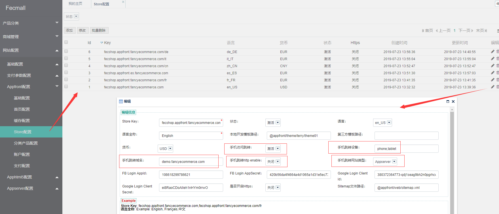

Fecshop 手机检测跳转
=================

> 当手机访问pc端(appfront)url，可以通过设置自动跳转到手机html5（apphtml5）端 
或者 vue端。

Fecshop-2.x更新说明
-------------

2版本更新为后台配置

菜单：网站配置-->Appfront(App)-> store配置





Fecshop-1.x
-------------

### 配置设置

`手机端`：html5 和 vue端 2个，我们可以通过配置的方式，来决定跳转到那个手机端

打开配置文件 `@appfront/config/fecshop_local_services/Store.php`

可以看到配置代码：

```
'fecshop.appfront.fancyecommerce.com' => [
    'language'         => 'en_US',        // 语言简码需要在@common/config/fecshop_local_services/FecshopLang.php 中定义。
    'languageName'     => 'English',    // 语言简码对应的文字名称，将会出现在语言切换列表中显示。
    'localThemeDir'    => '@appfront/theme/terry/theme01', // 设置当前store对应的模板路径。关于多模板的方面的知识，您可以参看fecshop多模板的知识。
    'thirdThemeDir'    => [ // 第三方模板路径，数组，可以多个路径
        
    ],  
    'currency'         => 'USD', // 当前store的默认货币,这个货币简码，必须在货币配置中配置
    /*
     * 当设备满足什么条件的时候，进行跳转。
     * 这种方式不怎么高效，最好的方式是在nginx中配置。
     */
    'mobile'        => [
        'enable'            => true,
        'condition'         => ['phone', 'tablet'], // phone 代表手机，tablet代表平板，当都填写，代表手机和平板都会进行跳转
        'redirectDomain'    => 'demo.fancyecommerce.com',    // 如果是移动设备访问进行域名跳转，这里填写的值为store key
        'https'             => false,  // 手机端url是否支持https,如果支持，设置https为true，如果不支持，设置为false
        'type'              => 'appserver',  //  填写值选择：[apphtml5, appserver]，如果是 apphtml5 ， 则表示跳转到html5入口，如果是appserver，则表示跳转到vue这种appserver对应的入口
    ],
```

`fecshop.appfront.fancyecommerce.com`: 该key是`store 名称`，是该store的唯一key

我们需要在相应的store中的`mobile`中进行设置

`enable`: 是否开启，true代表开启，false代表关闭

`condition`: 代表移动设备类型，phone 代表手机，tablet代表平板，当都填写，代表手机和平板都会进行跳转

`redirectDomain`: 你的手机端的`store 名称`

`https`: 您的手机端是否开启https，true代表开启，false代表关闭

`type`: 填写值选择：`[apphtml5, appserver]`，如果是 `apphtml5` ， 
则表示跳转到html5入口，如果是`appserver`，则表示跳转到vue这种appserver对应的入口


### 配置例子

1.vue端例子

url: http://fecshop.appfront.fancyecommerce.com/cn/ , 手机,平板设备
访问后，会跳转到vue端：http://demo.fancyecommerce.com/#/?lang=zh

设置：

```
'mobile'        => [
    'enable'            => true,
    'condition'         => ['phone', 'tablet'], // phone 代表手机，tablet代表平板，当都填写，代表手机和平板都会进行跳转
    'redirectDomain'    => 'demo.fancyecommerce.com',    // 如果是移动设备访问进行域名跳转，这里填写的值为store key
    'https'             => false,  // 手机端url是否支持https,如果支持，设置https为true，如果不支持，设置为false
    'type'              => 'appserver',  //  填写值选择：[apphtml5, appserver]，如果是 apphtml5 ， 则表示跳转到html5入口，如果是appserver，则表示跳转到vue这种appserver对应的入口
],
```

2.html5端例子

url: http://fecshop.appfront.fancyecommerce.com/fr/ , 手机,平板设备
访问后，会跳转到vue端：http://fecshop.apphtml5.fancyecommerce.com/fr/

设置：

```
'mobile'           => [
    'enable'               => true,
    'condition'            => ['phone'], // phone 代表手机，tablet代表平板。
    'redirectDomain'       => 'fecshop.apphtml5.fancyecommerce.com/fr', // 跳转后的url。
    'https'             => false,  // 手机端url是否支持https,如果支持，设置https为true，如果不支持，设置为false
    'type'              => 'apphtml5',  //  填写值选择：[apphtml5, appserver]，如果是 apphtml5 ， 则表示跳转到html5入口，如果是appserver，则表示跳转到vue这种appserver对应的入口
],
```


### html5跳转原理

打开`@fecshop/services/Store.php` ，您可以看到 `html5DevideCheckAndRedirect()`方法：

```
    /**
     * @property $store_code | String 
     * @property $store | Array
     * mobile devide url redirect.
     * pc端自动跳转到html5端的检测
     */
    protected function html5DevideCheckAndRedirect($store_code, $store)
    {
        if (!isset($store['mobile'])) {
            return;
        }
        $enable = isset($store['mobile']['enable']) ? $store['mobile']['enable'] : false;
        if (!$enable) {
            return;
        }
        $condition = isset($store['mobile']['condition']) ? $store['mobile']['condition'] : false;
        $redirectDomain = isset($store['mobile']['redirectDomain']) ? $store['mobile']['redirectDomain'] : false;
        $redirectType = isset($store['mobile']['type']) ? $store['mobile']['type'] : false;
        if (is_array($condition) && !empty($condition) && !empty($redirectDomain) && $redirectType === 'apphtml5') {
            $mobileDetect = Yii::$service->helper->mobileDetect;
            $mobile_https = (isset($store['mobile']['https']) && $store['mobile']['https']) ? true : false;
            if (in_array('phone', $condition) && in_array('tablet', $condition)) {
                if ($mobileDetect->isMobile()) {
                    $this->redirectAppHtml5Mobile($store_code, $redirectDomain, $mobile_https);
                }
            } elseif (in_array('phone', $condition)) {
                if ($mobileDetect->isMobile() && !$mobileDetect->isTablet()) {
                    $this->redirectAppHtml5Mobile($store_code, $redirectDomain, $mobile_https);
                }
            } elseif (in_array('tablet', $condition)) {
                if ($mobileDetect->isTablet()) {
                    $this->redirectAppHtml5Mobile($store_code, $redirectDomain, $mobile_https);
                }
            }
        }
    }

    /**
     * @property $store_code | String
     * @property $redirectDomain | String
     * 检测，html5端跳转检测
     */
    protected function redirectAppHtml5Mobile($store_code, $redirectDomain, $mobile_https)
    {
        $currentUrl = Yii::$service->url->getCurrentUrl();
        $redirectUrl = str_replace($store_code, $redirectDomain, $currentUrl);
        // pc端跳转到html5，可能一个是https，一个是http，因此需要下面的代码进行转换。
        if ($mobile_https) {
            if (strstr($redirectUrl,'https://') || strstr($redirectUrl,'http://')) {
                $redirectUrl = str_replace('http://','https://',$redirectUrl);
            } else {
                $redirectUrl = 'https:'.$redirectUrl;
            }
        } else {
            if (strstr($redirectUrl,'https://') || strstr($redirectUrl,'http://')) {
                $redirectUrl = str_replace('https://','http://',$redirectUrl);
            } else {
                $redirectUrl = 'http:'.$redirectUrl;
            }
        }
        header('Location:'.$redirectUrl);
        exit;
    }
```


`html5DevideCheckAndRedirect`方法检测是否是手机访问，如果是，则进行跳转。

因为html5和appfront（pc）端，只是域名的不同，urlPath部分都是一样的，
因此，该方法是在yii2框架初始化的时候被执行


### html5跳转原理

以产品页面跳转为例讲解

打开文件： @fecshop/app/appfront/modules/Catalog/controllers/ProductController.php

可以看到

```
    public function behaviors()
    {
        if (Yii::$service->store->isAppServerMobile()) {
            $primaryKey = Yii::$service->product->getPrimaryKey();
            $primaryVal = Yii::$app->request->get($primaryKey);
            $urlPath = 'catalog/product/'.$primaryVal;
            Yii::$service->store->redirectAppServerMobile($urlPath);
        }
        
        ...
        
    }
```


上面的代码就是跳转到vue端的逻辑，也就是先生成vue端的`$urlPath`,
然后通过`Yii::$service->store->redirectAppServerMobile($urlPath);`
进行跳转。

`Yii::$service->store`就是 `@fecshop/services/Store.php`


OK, 到这里就讲解完成，通过配置，您可以在store.php中设置 pc端跳转到手机端。


