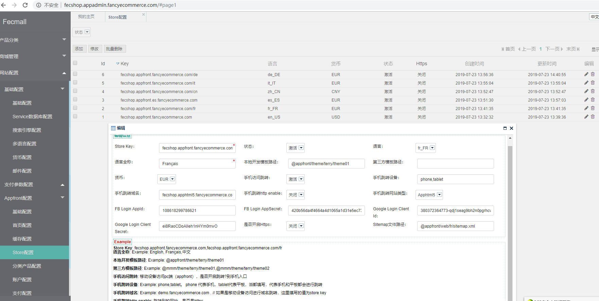

Fecshop Store
=============

> fecshop是支持多store的，store一般是用来构建多语言站点，
> 可以为每一个store指定不同的语言和url结构，设置不同的语言，默认货币,模板等。


Fecshop-2.x更新说明
-------------

2版本更新为后台配置




Fecshop-1.x
-------------


### 1.Store的配置：

您可以在`@appfront/config/fecshop_local_services/Store.php`中配置Store

示例代码：

```
'stores' => [	
	# store key：域名去掉http部分，作为key，这个必须这样定义。
	'fecshop.appfront.fancyecommerce.com' => [
		'language' 		=> 'en_US',		# 语言简码需要在@common/config/fecshop_local_services/FecshopLang.php 中定义。
		'languageName' 	=> 'English',	# 语言简码对应的文字名称，将会出现在语言切换列表中显示。
		'localThemeDir'	=> '@appfront/theme/terry/theme01', # 设置当前store对应的模板路径。关于多模板的方面的知识，您可以参看fecshop多模板的知识。
		'thirdThemeDir'	=> [],  # 第三方模板路径，数组，可以多个路径
		'currency' 		=> 'USD', # 当前store的默认货币,这个货币简码，必须在货币配置中配置
		'mobile'		=> [ # 当设备满足什么条件的时候，进行跳转。
			'enable'		=> true,
			'condition'		=> ['phone','tablet'], # phone 代表手机，tablet代表平板
			'redirectUrl' 	=> 'fecshop.apphtml5.fancyecommerce.com',	# 如果是移动设备访问进行域名跳转，这里填写的值为store key
		],
		# 第三方账号登录配置
		'thirdLogin' => [
			# facebook账号登录
			'facebook' =>[       #fb api配置 ，fb可以一个app设置pc和手机web两个域名 
				'facebook_app_id'     => '1849609081926823',
				'facebook_app_secret' => '2e097a6d5a424531770fc05760dd7139',
			],
			# google账号登录
			"google" => [       #谷歌api visit https://code.google.com/apis/console to generate your google api
				'CLIENT_ID'  	 => '380372364773-qdj1seag9bh2n0pgrhcv2r5uoc58ltp3.apps.googleusercontent.com',
				'CLIENT_SECRET'  => 'ei8RaoCDoAlIeh1nHYm0rrwO',
			],
		]
	],
```

需要注意的是您的store key，如果您的首页是
`http://fecshop.appfront.fancyecommerce.com`，那么您的key为
`fecshop.appfront.fancyecommerce.com`
，如果您的首页为
`http://fecshop.appfront.fancyecommerce.com/fr`，那么您的key为
`fecshop.appfront.fancyecommerce.com/fr`

您可以为您的每一个store指定特定的域名，用不同的子域名或用不同的语言路径的
方式，来构建您的多语言的网站。

### 2.多语言站点的构建方式：


#### 1.子域名的方式构建多语言站点，譬如：

`www.fecshop.com`（英文）,`fr.fecshop.com`（法文）  `de.fecshop.com`（德文）

这种方式可以在@app/web/index.php中设置 `ini_set('session.cookie_domain', '.fancyecommerce.com');`
来进行子域名之间session的共享。

#### 2.url路径的方式构建多语言站点，譬如：

`www.fecshop.com`（英文）,`www.fecshop.com/fr/`（法文）,`www.fecshop.com/de/`（德文）
这种多语言方式因为都是同样的域名，只是后缀不同，因此，
不需要像第1步那样做session共享

#### 3.独立多域名方式:

`www.fecshop.com`（英文）,`www.fecshop.fr`（法文）,`www.fancyecommerce.de`（德文）

这种方式，session不能共享（当然，您可以做跨域session共享，但是是比较麻烦的，
因此，建议使用第一种，子域的方式），因此购物车和登录信息在切换站点的时候，需要重新
进行登录。

### 4.store原理

4.1 在入口文件 `@app/web/index.php` ，可以加载所有的配置文件，合并

4.2 对于`appfront`  `appserver`  `apphtml5`这三个入口是需要`store`的，
因此需要在Yii2 bootstrap初始化过程中就开始执行，下面以appfront入口为例子讲解

`@fecshop/app/appfront/config/appfront.php` ， 可以看到配置：

```
'bootstrap' => ['store'],

```

也就是在初始化的时候执行store component，关于Yii2的bootstrap可以查看资料：
[启动引导（Bootstrapping）](http://www.yiichina.com/doc/guide/2.0/runtime-bootstrapping)
,
[yii2 初始化的bootstrap过程 -引导](http://www.fancyecommerce.com/2016/05/18/yii2-%E5%88%9D%E5%A7%8B%E5%8C%96%E7%9A%84bootstrap%E8%BF%87%E7%A8%8B-%E5%BC%95%E5%AF%BC/)

下面我们去找`store component`

4.3 打开配置文件： `@fecshop/config/components/Store.php` 文件可以看到：

```
return [
    'store' => [
        'class' => 'fecshop\components\Store',
    ],
];
```

通过配置文件，我们找到`store component` , `@fecshop\components\Store.php`,
代码如下：

```
class Store extends Component implements BootstrapInterface
{
    public function bootstrap($app)
    {
        Yii::$service->store->bootstrap($app);
    }
}
```

通过上面的代码，我们可以看到，就是执行store services 的`bootstrap`方法
，通过配置文件：`@fecshop/config/services/Store.php`，我们可以看到

```
'store' => [
        'class' => 'fecshop\services\Store',
```

我们打开 `@fecshop\services\Store.php` ,查看 `bootstrap()`方法，
可以看到很多`store`的初始化代码，譬如语言，货币等，
都是在这个函数里面进行的，您可以细看里面的代码，具体您可以查看这个文件，这里不做代码粘贴了。


