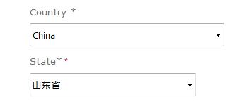

Fecmall 国家
===========

> fecmall 国家的配置

国家的设置，对于下拉条选择的方式，目前只支持国家，省/直辖市 ，
还是无法到city的，

打开文件：@fecshop/services/helper/Country.php

国家一般是不会变动的，如果您想重写可以重写函数
getAllCountryArray()

对于省，不是每一个国家都编辑了的，只有部分国家的省进行了编辑
打开上面的文件查看函数：getCountryStateArr()，
譬如美国的省的配置：

US是上面 getAllCountryArray()函数返回数组中的key，也就是国家简码

AL 是Alabama这个省（州）的简码，Alabama是省的名字，
对于省的简码，可以随便写，只要在数组中唯一就行了。

```
'US' => [
	'AL' => 'Alabama', 
	'AK' => 'Alaska', 
	'AS' => 'American Samoa',
	'AZ' => 'Arizona', 
	'AR' => 'Arkansas', 
	'AF' => 'Armed Forces Africa',
	'AA' => 'Armed Forces Americas', 
	'AC' => 'Armed Forces Canada',
	'AE' => 'Armed Forces Europe', 
	'AM' => 'Armed Forces Middle East',
	'AP' => 'Armed Forces Pacific', 
	'CA' => 'California', 
	'CO' => 'Colorado',
	'CT' => 'Connecticut', 
	'DE' => 'Delaware', 
	'DC' => 'District of Columbia',
	'FM' => 'Federated States Of Micronesia', 
	'FL' => 'Florida', 
	'GA' => 'Georgia',
	'GU' => 'Guam', 
	'HI' => 'Hawaii', 
	'ID' => 'Idaho', 
	'IL' => 'Illinois',
	'IN' => 'Indiana', 
	'IA' => 'Iowa', 
	'KS' => 'Kansas', 
	'KY' => 'Kentucky',
	'LA' => 'Louisiana', 
	'ME' => 'Maine', 
	'MH' => 'Marshall Islands',
	'MD' => 'Maryland', 
	'MA' => 'Massachusetts', 
	'MI' => 'Michigan',
	'MN' => 'Minnesota', 
	'MS' => 'Mississippi', 
	'MO' => 'Missouri',
	'MT' => 'Montana', 
	'NE' => 'Nebraska', 
	'NV' => 'Nevada',
	'NH' => 'New Hampshire', 
	'NJ' => 'New Jersey', 
	'NM' => 'New Mexico',
	'NY' => 'New York', 
	'NC' => 'North Carolina', 
	'ND' => 'North Dakota',
	'MP' => 'Northern Mariana Islands', 
	'OH' => 'Ohio', 
	'OK' => 'Oklahoma',
	'OR' => 'Oregon', 
	'PW' => 'Palau', 
	'PA' => 'Pennsylvania',
	'PR' => 'Puerto Rico', 
	'RI' => 'Rhode Island', 
	'SC' => 'South Carolina',
	'SD' => 'South Dakota', 
	'TN' => 'Tennessee', 
	'TX' => 'Texas',
	'UT' => 'Utah', 
	'VT' => 'Vermont', 
	'VI' => 'Virgin Islands',
	'VA' => 'Virginia', 
	'WA' => 'Washington', 
	'WV' => 'West Virginia',
	'WI' => 'Wisconsin', 
	'WY' => 'Wyoming',
],
```


譬如中国的配置：


```
'CN' => [
	'BJ' => '北京市',
	'SH' => '上海市',
	'TJ' => '天津市',
	'CQ' => '重庆市',
	'HEB' => '河北省',
	'SAX' => '山西省',
	'LN' => '辽宁省',
	'JL' => '吉林省',
	'HLJ' => '黑龙江省',
	'JS' => '江苏省',
	'ZJ' => '浙江省',
	'AH' => '安徽省',
	'FJ' => '福建省',
	'JX' => '江西省',
	'SD' => '山东省',
	'HEN' => '河南省',
	'HUB' => '湖北省',
	'HUN' => '湖南省',
	'GD' => '广东省',
	'HN' => '海南省',
	'SC' => '四川省',
	'HZ' => '贵州省',
	'YN' => '云南省',
	'SNX' => '陕西省',
	'GS' => '甘肃省',
	'QH' => '青海省',
	'TW' => '台湾省',
	'GX' => '广西壮族自治区',
	'NMG' => '内蒙古自治区',
	'XZ' => '西藏自治区',
	'NX' => '宁夏回族自治区',
	'XJ' => '新疆维吾尔自治区',
	'XG' => '香港特别行政区',
	
],
```


如果您专做的国家市场，在这里没有省市，您可以重写这个函数，然后
把相应的省市信息添加到数组中。


如果在 getCountryStateArr() 返回的数组中不存在的国家，
在下单页面，就需要用户在输入框中填写国家，


如果在getCountryStateArr()返回的数组中存在相应的国家和省的数据
那么在下单页面，省部分是下拉条选择。




您可以重写 getCountryStateArr()方法，把您想要专做市场的国家对应的省
填写进去。


