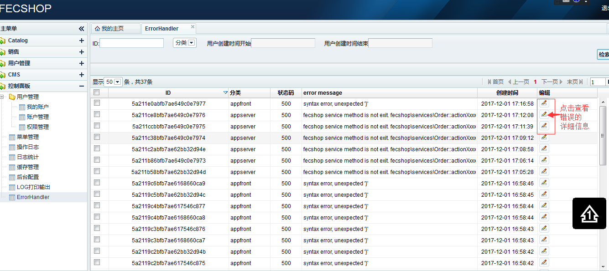

Fecmall Error Handler
====================

> Error Handler指的是Yii2的错误捕捉机制，fecmall利用了
> Yii2的error Handle机制来记录系统的异常。


### Fecmall重新处理errorHandler的原因

**本地开发环境：**

在开发环境中，web界面的报错信息直接报出在访问界面，一点问题也没有，对于api类型
，在开发的过程中也可以直接报出，同样没有安全问题。

**线上环境:**

1.如果报错直接输出，会暴露网站的很多信息，这样是非常不安全的，
而如果使用yii2默认的`PROD`的`errorHandler`处理方式，只显示一句
`An internal server error occurred.`，用户反馈报错给开发者后，
开发者在日志中看到一堆的报错，不知道那个报错是这个用户的报错，
因此不利于开发者快速的定位问题。

2.比较好的方式，在报错的时候，系统在写入日志的时候，返回一个`错误编码`，


```
{
    "code":500,
    "error_no":"5a2113f5bfb7ae617546c872"
}
```

3.用户访问页面报错后，将`错误编码`反馈给开发者，开发者
通过`错误编码`，到日志中找到该用户的报错信息，这样可以更方便的处理用户的
的错误。

4.另外，我们通过日志的方式，可以记录网站在运行期间出现的所有错误url，
有了这个信息，我们就可以依次排查各个错误的原因，进而将
网站出现的问题都清楚掉，让网站更加稳健。

### Error Handler

打开配置文件 @fecshop/app/app入口/config/appserver.php  

> app入口 代指:appfront, appserver,  apphtml5, appapi]

你可以看到`errorHandler`的配置，譬如：@fecshop/app/appfront/config/appserver.php

```
// product 生产环境，errorHandler使用 AppfrontErrorHandler
if (YII_ENV_PROD) {
    $config['components']['errorHandler']['class'] = 'fecshop\components\AppfrontErrorHandler';
}
```

上面指的是，当环境为`PROD`时（在入口index.php中设置`YII_ENV`），
errorHandler 将使用配置中的`class`，下面我们看一下这个class

打开文件`@fecshop/components/AppfrontErrorHandler.php`

```
<?php
namespace fecshop\components;

use Yii;
use yii\web\ErrorHandler;
use yii\base\Exception;

/**
 * 异常捕获器
 */
class AppfrontErrorHandler extends ErrorHandler
{
    /**
     * [renderException description]
     * @property  $exception | Object 异常数据对象
     * 
     */
    public function renderException($exception)
    {
        //echo 1;exit;
        // 获取异常数据 , 404页面不做收集
        $code = $exception->statusCode ?: 500; 
        if ($code != 404) {
            method_exists($exception,'getMessage')  ? $message  = $exception->getMessage()  : $message = '';
            method_exists($exception,'getName')     ? $name     = $exception->getName()     : $name = '';
            method_exists($exception,'getFile')     ? $file     = $exception->getFile()     : $file = '';
            method_exists($exception,'getLine')     ? $line     = $exception->getLine()     : $line = '';
            method_exists($exception,'getTraceAsString') ? $traceString = $exception->getTraceAsString() : $traceString = '';
            
            $time     = time();
            $ip       = Yii::$app->request->userIP;
            $url      = Yii::$service->url->getCurrentUrl();
            $req_info = $this->getRequestInfo();
            $reponse = Yii::$app->response;
            Yii::$app->response->format = $reponse::FORMAT_JSON;
            if (YII_ENV_PROD) {
                
                $errorKey = $this->saveProdException($code, $message, $file, $line, $time, $ip, $name, $traceString, $url, $req_info);
                Yii::$app->response->data = [
                    'code'      => $code,
                    'error_no'  => $errorKey,
                ];
                Yii::$app->response->send();
                Yii::$app->end();
            } else {
                $time    = date('Y-m-d H:i:s', $time);
                $exceptionInfo = [
                    'code'      => $code, 
                    'message'   => $message,
                    'file'      => $file,
                    'line'      => $line,
                    'time'      => $time,
                    'ip'        => $ip,
                    'name'      => $name,
                    'traceString' => $traceString,
                ];
                Yii::$app->response->data = $exceptionInfo;
                Yii::$app->response->send();
                Yii::$app->end();
            }
        } else {
            parent::renderException($exception);
        }
    }
    
    public function getRequestInfo(){
        $request = Yii::$app->request;
        $ajax = 0;
        $request_type = '';
        $request_data = [];
        $header_accept = '';
        $header_user_agent = '';
        if ($request->isAjax) { 
            $ajax = 1;
        }
        if ($request->isGet)  { 
            $request_type = 'get';
            $request_data = $request->get();
        }
        if ($request->isPost) { 
            $request_type = 'post';
            $request_data = $request->post();
        }
        // $headers is an object of yii\web\HeaderCollection 
        $headers = $request->getHeaders();
        $headers_arr = [];
        if (is_object($headers) or is_array($headers)) {
            foreach ($headers as $k=>$v) {
                $headers_arr[$k] = $v;
            }
        }
        $userHost   = Yii::$app->request->userHost; 
        $userIP     = Yii::$app->request->userIP;
        return [
            'ajax'              => $ajax,
            'request_type'      => $request_type,
            'request_data'      => $request_data,
            'headers_data'      => $headers_arr,
            'userHost'          => $userHost,
            'userIP'            => $userIP,
        ];
    }
        
    public function saveProdException($code, $message, $file, $line, $created_at, $ip, $name, $trace_string, $url, $req_info){
        return Yii::$service->helper->errorHandler->saveByErrorHandler(
            $code, $message, $file, $line, $created_at,
            $ip, $name, $trace_string, $url, $req_info
        );
        
    }
    /**
     * 这块代码目前没有编写，您也可以用 Sentry（错误日志收集框架） 来收集错误日志。
     * $option = [
     *   'fromMail' => 'xxx@xxx.com',
     *   'subject'  => 'fecshop报错 Code:' . $exceptionInfo['code'],
     *   'htmlBody' => '异常' . '(' . YII_ENV . ')' . $exceptionInfo['code'] . ':' . $exceptionInfo['message'] . '<br />文件：' . $exceptionInfo['file'] . ':' . $exceptionInfo['line'] . '<br /> 时间：' . $exceptionInfo['time'] . '<br />请求ip：' . $exceptionInfo['ip'],
     * ];
     *
     *
     *if (!$result) {
     *    throw new Exception("Exception mail send faild!", 1);
     *}
     */
}


```

通过上面的代码可以看到，错误写到了mongodb表：error_handler_log 中，
该表数据中的`_id`，就是反馈给用户的 `"error_no":"5a2113f5bfb7ae617546c872"`

```
{
    "code":500,
    "error_no":"5a2113f5bfb7ae617546c872"
}
```

保存的error信息，可以在后台  `控制面板-->ErrorHanele` 中查看



将 `error_no` 粘贴到`ID`处，即可进行查询相应的错误信息。

### 总结：

1.如果是开发环境，使用的是Yii2默认的error处理方式，直接报错输出

2.如果是`PROD`生产环境，appfront apphtml5这种web类的入口，
`404`错误还是用的Yii2默认的error处理方式，
因此，会出现一个`404`的WEB页面，告诉用户该页面不存在。
对于appapi，appserver接口类入口的`404`错误
，譬如：appapi，appserver 404错误
将使用 `@fecshop/components/AppserverErrorHandler.php` 来处理。

3.如果是生产环境，其他的错误将由fecshop的`errorHandle`处理

3.1 apphtml5  appfront的`errorHandler`使用的是 `@fecshop/components/AppfrontErrorHandler.php`

3.2 appserver  appapi的`errorHandler`使用的是 `@fecshop/components/AppserverErrorHandler.php`

4.如果使用了fecshop的`errorhandler`，只返回`code`和`errorKey`给用户，其他的信息通过函数
`saveProdException()`保存到`mongodb`中。

5.用户将`errorKey`的值发给开发者，开发者可以通过 `errorKey` 在mongodb表
`error_handler_log`中查询到具体的错误

6.这样做的好处是，让线上环境将具体的错误隐藏起来，还可以通过反馈给用户的
错误编号找到相应的错误，让开发者快速定位当前用户的问题。

7.将开发环境设置成生产环境的方式：

在@app/web/index.php中，将

```
defined('YII_DEBUG') or define('YII_DEBUG', true);
defined('YII_ENV') or define('YII_ENV', 'dev'); 
```

设置成：

```
defined('YII_DEBUG') or define('YII_DEBUG', false);
defined('YII_ENV') or define('YII_ENV', 'prod');
```

即可切换到生产环境

8.mongodb表`error_handler_log`中保存的错误信息数据示例:

```
{
  "_id": ObjectId("5a211e0abfb7ae649c0e7977"),
  "category": "appfront",
  "code": NumberInt(500),
  "message": "syntax error, unexpected '}'",
  "file": "/www/web/develop/fecshop/vendor/fancyecommerce/fecshop/app/appfront/modules/Customer/controllers/TestController.php",
  "line": NumberInt(31),
  "created_at": NumberInt(1512119818),
  "ip": "113.116.124.39",
  "name": "",
  "url": "//fecshop.appfront.fancyecommerce.com/customer/test?fd=3232&323=232",
  "request_info": {
    "ajax": NumberInt(0),
    "request_type": "get",
    "request_data": {
      "fd": "3232",
      "323": "232"
    },
    "headers_data": {
      "cache-control": [
        "max-age=0"
      ],
      "upgrade-insecure-requests": [
        "1"
      ],
      "connection": [
        "keep-alive"
      ],
      "cookie": [
        "Hm_lvt_9cfdb8cb93410e80005df709d26cd1c6=1511760319,1511796767,1511797236,1511838720; _ga=GA1.2.395760026.1496285492; PHPSESSID=mqk98mldqgqficiksoqb69h8ui; _csrf=d59b458176e323d701f64264dbb8fe770ba8e30c26a799002cd5aa4af50db072a%3A2%3A%7Bi%3A0%3Bs%3A5%3A%22_csrf%22%3Bi%3A1%3Bs%3A32%3A%22%89%C6%E9zkg%16%28%0A%2A%E4u%83%F3%FD%8B%80A%87%89%99%FC%24%EE%09Y%5B2%FA%82%94B%22%3B%7D"
      ],
      "accept-encoding": [
        "gzip, deflate, br"
      ],
      "accept-language": [
        "zh-CN,zh;q=0.8,zh-TW;q=0.7,zh-HK;q=0.5,en-US;q=0.3,en;q=0.2"
      ],
      "accept": [
        "text/html,application/xhtml+xml,application/xml;q=0.9,*/*;q=0.8"
      ],
      "user-agent": [
        "Mozilla/5.0 (Windows NT 6.1; Win64; x64; rv:57.0) Gecko/20100101 Firefox/57.0"
      ],
      "host": [
        "fecshop.appfront.fancyecommerce.com"
      ]
    },
    "userHost": null,
    "userIP": "113.116.124.39"
  },
  "trace_string": "#0 /www/web/develop/fecshop/vendor/composer/ClassLoader.php(301): Composer\\Autoload\\includeFile('/www/web/develo...')\n#1 [internal function]: Composer\\Autoload\\ClassLoader->loadClass('fecshop\\\\app\\\\app...')\n#2 [internal function]: spl_autoload_call('fecshop\\\\app\\\\app...')\n#3 /www/web/develop/fecshop/vendor/yiisoft/yii2/base/Module.php(633): class_exists('fecshop\\\\app\\\\app...')\n#4 /www/web/develop/fecshop/vendor/yiisoft/yii2/base/Module.php(591): yii\\base\\Module->createControllerByID('test')\n#5 /www/web/develop/fecshop/vendor/yiisoft/yii2/base/Module.php(583): yii\\base\\Module->createController('')\n#6 /www/web/develop/fecshop/vendor/yiisoft/yii2/base/Module.php(517): yii\\base\\Module->createController('test')\n#7 /www/web/develop/fecshop/vendor/yiisoft/yii2/web/Application.php(102): yii\\base\\Module->runAction('customer/test', Array)\n#8 /www/web/develop/fecshop/vendor/yiisoft/yii2/base/Application.php(380): yii\\web\\Application->handleRequest(Object(fecshop\\yii\\web\\Request))\n#9 /www/web/develop/fecshop/appfront/web/index.php(86): yii\\base\\Application->run()\n#10 {main}"
}
```

9.重写errorHandle，按照自己的方式处理

您可以在本地配置中添加配置，来覆盖fecshop默认的配置。

```
$config['components']['errorHandler']['class'] = '您自己的errorHandler处理class';
```