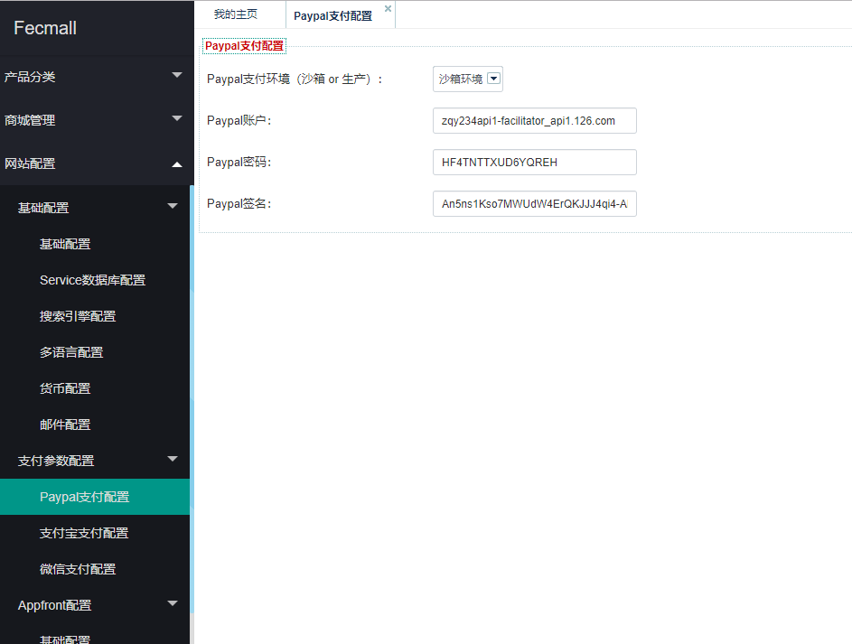
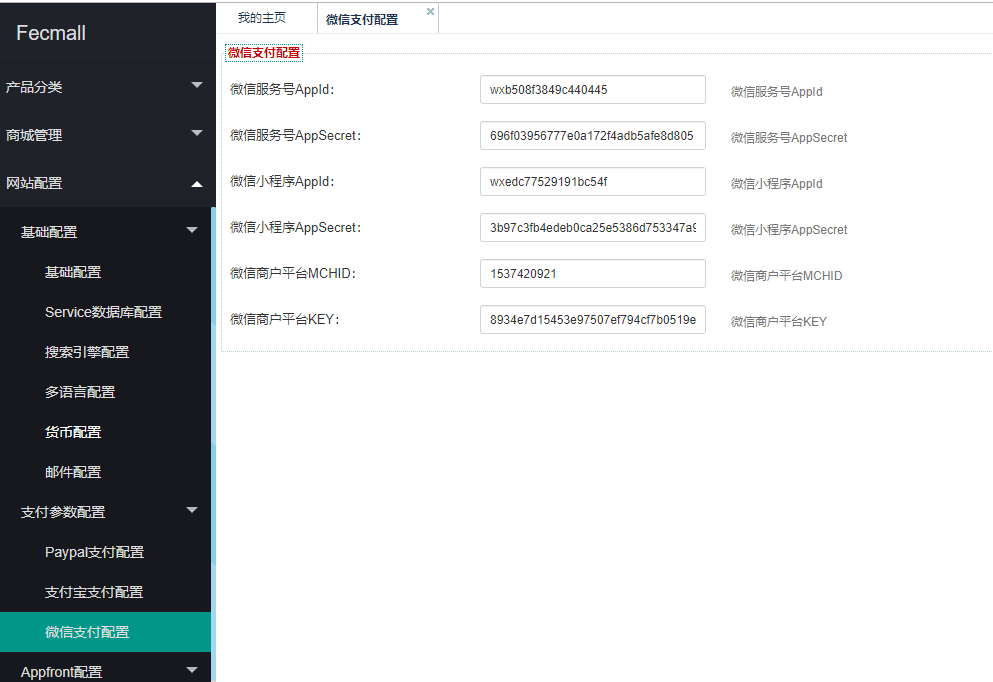
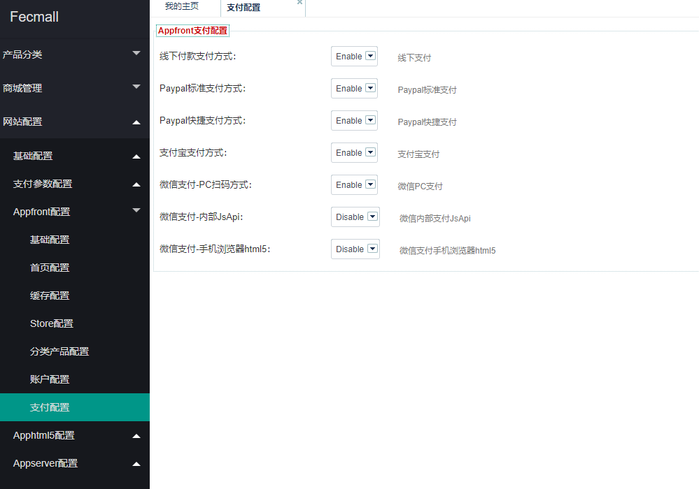

Fecmall 支付
==============

> 对支付平台的配置信息。

### Fecmall 后台配置支付

1.设置各个支付的信息，譬如下面设置微信和paypal支付

2.在各个入口进行开启和关闭支付，下面是在appfront入口设置开启和关闭支付。

### 设置paypal支付

**登录paypal，开启IPN**

> 一定要登录paypal官网 www.paypal.com，设置开启IPN，否则将无法接收paypal的IPN消息。

**一定要登录paypal官网 www.paypal.com，设置开启IPN，否则将无法接收paypal的IPN消息。**

**一定要登录paypal官网 www.paypal.com，设置开启IPN，否则将无法接收paypal的IPN消息。**

**一定要登录paypal官网 www.paypal.com，设置开启IPN，否则将无法接收paypal的IPN消息。**

重要的事情说三遍，下面是详细的设置步骤。

设置完成后，就可以接收IPN消息了。

为什么要设置接收IPN呢？可以参看一下这个文章：http://www.fecshop.com/topic/457

### 设置微信支付

后台配置微信支付即可。

资料：[Fecmall 微信支付](fecmall_payment_wx_method.md)

### 支付宝支付

后台配置支付宝支付即可。

### 开发新支付 - 配置

当您想要开发一个新的支付方式的时候，您需要做一个跳转到第三方支付平台的准备页面（payment start url）
和一个支付成功返回的页面url。

下面是详细的步骤，我这里也有一个支付宝开发的详细步骤，供参考，地址为：http://www.fecshop.com/topic/143

#### 1.1 支付跳转前的工作

在支付页面，填写好支付信息后，点击支付按钮，fecmall会先进行一系列的处理，
最终生成订单，将订单编号保存到session中，然后跳转到当前支付配置对应的
`start_url`,譬如上面paypal的`start_url`为`@homeUrl/payment/paypal/standard/start`
（@homeUrl是首页url），在这个url中，需要将订单中的字段值取出，组合成支付平台想要的
数据格式，发送给第三方支付平台，并进行跳转到第三方支付平台。

#### 1.2 支付成功跳转后的工作

支付成功后，用户通过点击，或者由第三方支付平台自动，跳转到网站中，也就是上面配置的
`success_redirect_url`,该url对应的内容显示用户支付成功后的信息

#### 1.3 在第三方支付平台取消订单

如果用户在支付平台点击取消订单，那么就会跳转到fecshop的取消订单的链接，
也就是`cancel_url`对应的链接

#### 1.4 IPN消息url

当用户支付成功后，支付平台会给fecshop发送一个支付成功的消息，fecshop接收到消息
后会把接收到的参数传递给paypal并进行询问是否是paypal发送的，当paypal反馈是，
fecshop会把订单支付状态改成`processing`

### 开发新支付 - 功能实现

上面填写的4个url，您可以扩展一个新模块实现url对应的功能即可。
二开支付，知道原理后，还是蛮容易的。

paypal支付详细说明：

paypal有两种支付方式，一种是购物车页面点击支付按钮的方式，一种是
填写完成货运地址等信息后，在支付的方式。

paypal 购物车按钮流程

1.购物车点击paypal支付按钮，进入start部分：
	
    1.1 检查产品库存，如果库存不足，则返回购物车页面
	
    1.2 生成订单，订单只有order_id,increment_id,payment_token几个字段填写值，其他为空
	
    1.2 获取token，跳转到paypal express部分

2.进入paypal网站，确认后返回网站
	
    2.1 用户登录后点击continue，跳回网站return url，在该页面api获取用户paypal保存的货运地址，自动填写货运地址

3.提交
	
    3.1 用户修改货运地址等编辑信息。
	
    3.2 用户点击提交按钮，发起支付请求。
	
    3.3 服务器端检验用户提交的货运地址等信息是否正确
	
    3.4 如果用户使用的是新地址，则插入用户的货运地址。
	
    3.5 生成订单，不清空购物车，但是扣除库存。（生成订单的时候，是通过1.1的token进行查询出来的，而不是new的新的）
	
	
    3.6 如果api请求发生报错，那么返回到return页面（譬如货运地址填写错误等），显示报错信息，让用户重新编辑信息提交，重新发起支付请求。
	
    3.7 如果发生报错多次，token就会失效，paypal会拒绝请求。返回一个token超出最大使用次数。
	
    3.8 api发起支付请求，支付成功后，把支付信息写入到订单中，清空购物车。	
	
    3.9 最后跳转到支付成功页面。支付成功页面一般加入以下监控的js，接收支付成功信息。

注意：ipn部分目前没有做任何处理，只是打印了一下log，
如果用户在paypal提出申诉，要求退款等，paypal会给网站发送一个消息，
网站这边不会同步订单状态为“取消”，而是让erp那边做处理。

paypal 填写货运地址在点击支付的流程。

1.  填写表单：

    1.1 用户在购物车页面填写地址信息，货运方式，支付方式
    
    1.2 用户提交
    
    1.3 服务端接收信息生成订单，生成订单扣除产品库存，但是不清空购物车，
        然后根据配置的startUrl，跳转到相应的链接
    
    1.4 生成订单的时候，如果存在错误，跳转到checkout/onepage页面，显示报错信息
2.  Start部分：
    
    2.1 提交相应订单信息获取token
    
    2.2 更新token到订单中
    
    2.3 跳转到paypal支付网站，登录后，点击pay now返回网站（购物车点击过去，显示的按钮是continue）

3.  return部分：
    
    3.1 通过返回的token，查询订单，得到订单信息
    
    3.2 根据订单信息，拼装成api url，api发送下单请求。
    
    3.3 如果下单失败，跳转到checkout/onepage页面，显示报错信息
    
    3.4 如果下单成功，清空购物车
    
    3.5 跳转到支付成功页面。
    
   
如果您想开发一个新支付，可以参考下支付宝支付的整个步骤：
[Fecmall 支付宝支付开发思路 和 详细的文件结构](http://www.fecshop.com/topic/143)   
，这个文章写得比较详细，可以了解整个流程。  

