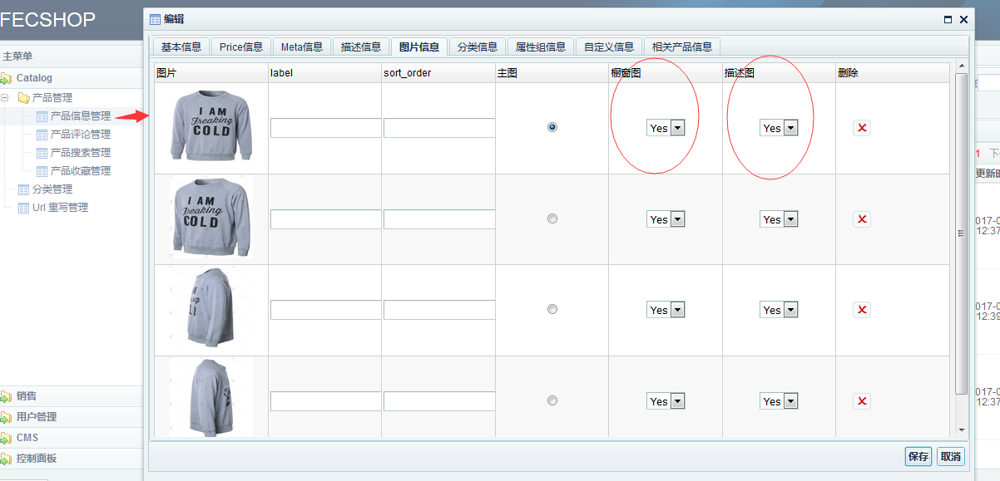
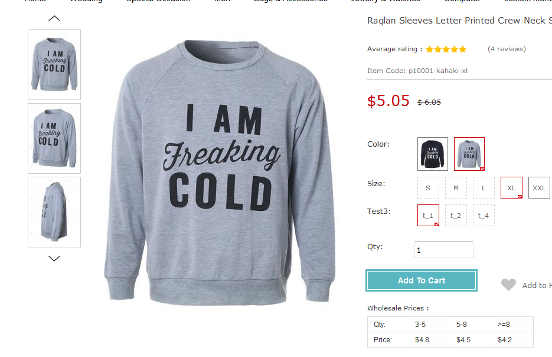
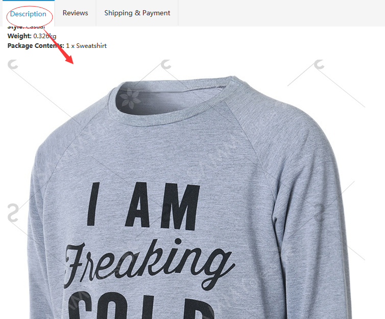

Fecmall 产品图片
================

>  fecmall 产品图片的实现思路，有很多参考了magento的图片生成的思路


### 1.fecmall后台配置图片参数


### 2.fecmall产品图片的调用

原图的调用：

`Yii::$service->image->getImgUrl('/2/01/20160905101021_28071.jpg')`;

自定义尺寸的调用：

`Yii::$service->product->image->getResize('/2/01/20160905101021_28071.jpg',[230,230],false);`

在自定义尺寸的调用的函数中 [230,230] 为width 和height的尺寸,详细参看函数：

```
/**
     * $imgResize 可以为数组 [230,230] 代表生成的图片为230*230，如果宽度或者高度不够，则会用白色填充
     * 如果 $imgResize设置为 230， 则宽度不变，高度按照原始图的比例计算出来。
     */
    protected function actionGetResize($imageVal, $imgResize, $isWatered = false)
    {
        
        $originImgPath = $this->getDir($imageVal);
        if (!file_exists($originImgPath)) {
            $originImgPath = $this->getDir($this->defaultImg);
        }
        $waterImgPath = '';
        if ($isWatered) {
            $waterImgPath = $this->getDir('/'.$this->waterImg);
        }
        list($newPath, $newUrl) = $this->getProductNewPath($imageVal, $imgResize, $waterImgPath);
        if (!file_exists($newPath)) {
            \fec\helpers\CImage::saveResizeMiddleWaterImg($originImgPath, $newPath, $imgResize, $waterImgPath);
        }

        return $newUrl;
    }
```

图片按照尺寸调用的时候，php会去磁盘去查找该尺寸对应的产品图片
文件是否存在，如果不存在，php则会生成相应尺寸的图片存放到磁盘，
下次访问该图片，就直接调用生成后的图片。


上面的函数中,`$isWatered`代表是否打水印。


### 3.图片水印。

首先需要上传您的水印图。按照默认设置，水印图路径为
`@appimage/common/media/catalog/product/product_water.jpg`
,您上传一张图覆盖这个水印图

然后在调用的时候，
自定义尺寸的调用：`Yii::$service->product->image->getResize($product['image'],[230,230],true);`
，第三个参数为true即可。

注意：目前原图是直接调用，如果想要打水印，您可以生成一个大尺寸的，
如果您不想让您的原图暴露，可以把程序里面所有的原图访问更改成
尺寸处理后的图片，然后nginx设置，封锁死原图访问url即可。


### 4.图片显示设置

在后台编辑的时候可以看到如下：



主图：代表产品的主图，在分类页面，购物车页面等，显示的都是产品的主图。


橱窗图：代表是的在产品详细页面顶部左侧显示的图片（如果是主图，无论是否设置成yes，都是橱窗图）
对于橱窗图的位置，参看图：



描述图：代表的是在产品详情页面，description描述下面显示的产品图



当一个产品设置成描述图，就会在产品描述部分下面显示出来。


